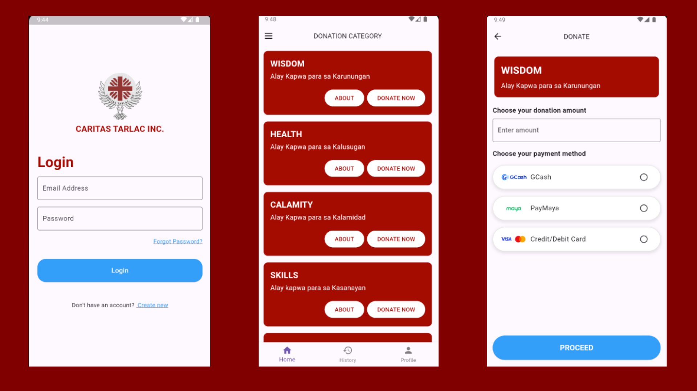

# Donation App

## Features
- **Payment Integration**: Supports payment through GCash, PayMaya, and Credit/Debit Cards using PayMongo API.
- **Donation Categories**: Allows users to select a donation category and amount.
- **Secure Authentication**: Uses OAuth token-based authentication and secure storage for sensitive data.
## Screenshots

## Getting Started
### Prerequisites
Before you begin, ensure you have met the following requirements:
- [Flutter SDK](https://flutter.dev/docs/get-started/install) (version 3.0.0 or higher)
- PayMongo account for API keys
- Backend server with authentication and user data retrieval (if required)
### Setup Instructions
1. **Clone the repository**
   ```bash
   git clone https://github.com/ipetersenpai/Donation-Flutter-App.git
   cd Donation-Flutter-App
   ```
2. **Install dependencies**
   Ensure you have Flutter and Dart installed. Then run:
   ```bash
   flutter pub get
   ```
3. **Environment Configuration**
   Create a `.env` file in the root of your project with the following variables:
   ```plaintext
   PAYMONGO_SECRET_KEY=your_paymongo_secret_key
   BASE_URL=your_backend_base_url
   BASE_URL_WEB=your_web_base_url_for_redirects
   ```
4. **Set up secure storage for tokens**
   The app uses `flutter_secure_storage` for securely storing access tokens.
   ```bash
   flutter pub add flutter_secure_storage
   ```
5. **Backend Integration**
   Ensure your backend provides user data (first name, last name, email, contact number) for the donation. The backend should support token-based authentication.
6. **Run the app**
   Start the Flutter app on your preferred device:
   ```bash
   flutter run
   ```
## Test Card Details
Use any of the following test card numbers with a valid expiration date in the future and any random CVC number to create a successful payment through PayMongo.
| Card Number         | Brand             | CVC           | Expiration Date  |
|---------------------|-------------------|---------------|------------------|
| 4343434343434345     | Visa              | Any 3 digits  | Any future date  |
| 4571736000000075     | Visa (debit)      | Any 3 digits  | Any future date  |
| 4009930000001421     | Visa (credit - PH)| Any 3 digits  | Any future date  |
| 4404520000001439     | Visa (debit - PH) | Any 3 digits  | Any future date  |
| 5555444444444457     | Mastercard        | Any 3 digits  | Any future date  |
| 5455590000000009     | Mastercard (debit)| Any 3 digits  | Any future date  |
| 5339080000000003     | Mastercard (prepaid) | Any 3 digits | Any future date |
| 5240050000001440     | Mastercard (credit - PH) | Any 3 digits | Any future date |
| 5577510000001446     | Mastercard (debit - PH) | Any 3 digits | Any future date |
## Usage
1. Enter a donation amount (minimum PHP 40).
2. Select a payment method (GCash, PayMaya, or Credit/Debit Card).
3. If paying via Credit/Debit card, input card details.
4. Proceed with the payment.
5. After successful payment, you will see a confirmation dialog.
## API Integration
This app integrates with PayMongo for payment processing. For more details on the API, see [PayMongo Documentation](https://developers.paymongo.com/docs).
## License
This project is licensed under the MIT License - see the [LICENSE](LICENSE) file for details.